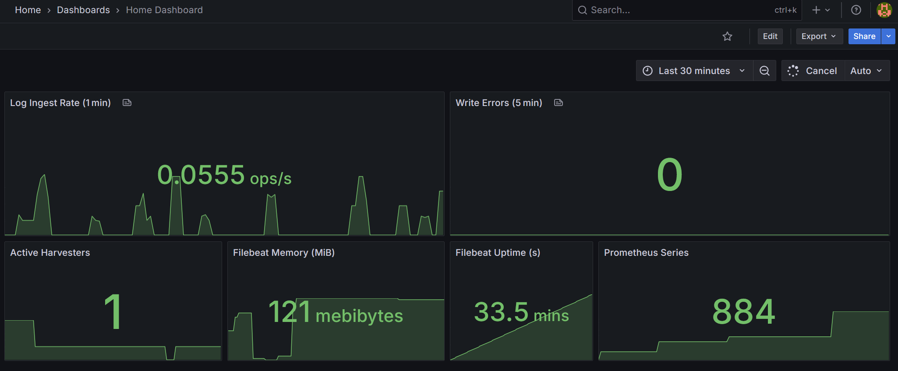

# 🔍 Monitoring stack: Grafana + Prometheus + Filebeat (Ubuntu 24.04)

## What you get

| Component          | How it runs                      | Purpose                                                                                              |
|--------------------|----------------------------------|------------------------------------------------------------------------------------------------------|
| **Filebeat 8.x**   | Installed by Ansible (systemd)   | Reads Docker container logs, writes them to `/var/log/test*`, exposes internal metrics on **`5066`** |
| **beat-exporter**  | Docker container (port **9479**) | Converts Filebeat stats ➔ Prometheus metrics                                                         |
| **Prometheus**     | Docker container (port **9090**) | Scrapes `beat-exporter:9479` and its own `/metrics` endpoint on 9090, stores TSDB                    |
| **Grafana**        | Docker container (port **80**)   | Auto-provisioned datasource + Home dashboard                                                         |
| **Home Dashboard** | Refresh 5s                       | Log rate, write errors, harvesters, RAM, uptime, Prometheus series                                   |                                   |

> **Target system:** Ubuntu 24.04 (Docker 24+, docker‑compose‑plugin, Ansible ≥ 2.15).

---

## Quick start (90 seconds)

```bash
# 1. Clone repository
git clone https://github.com/Revastein/ansible-monitoring-stack && cd ansible-monitoring-stack

# 2. Install required Ansible collections
ansible-galaxy install -r ansible/requirements.yml

# 3. Install everything
sudo ansible-playbook -i ansible/inventory.ini ansible/site.yml --tags install
```

## Open in Browser

| Service        | URL                     | Credentials                                                                    |
|----------------|-------------------------|--------------------------------------------------------------------------------|
| **Grafana**    | <http://localhost>      | **user** - `admin` <br/> **password** `sudo cat ./secrets/.grafana_admin_pass` |
| **Prometheus** | <http://localhost:9090> | —                                                                              |

## Partial runs

| Task                                | Tag       | Command                             |
|-------------------------------------|-----------|-------------------------------------|
| Full deployment & startup           | `install` | `ansible-playbook … --tags install` |
| Cleanup volumes & logs              | `cleanup` | `ansible-playbook … --tags cleanup` |
| Only update dashboards / datasource | `grafana` | `ansible-playbook … --tags grafana` |
| Bring up / restart Docker stack     | `stack`   | `ansible-playbook … --tags stack`   |

## Home dashboard metrics

| Panel (as shown in Grafana) | PromQL                                                         | What it tells you & why it matters                                                                                                                                     |
|-----------------------------|----------------------------------------------------------------|------------------------------------------------------------------------------------------------------------------------------------------------------------------------|
| **Log Ingest Rate (1 min)** | `rate(filebeat_libbeat_pipeline_events{type="published"}[1m])` | Average number of log events published per second over the last minute. **Spike** = heavy load or error burst; **drop to 0** = Filebeat may have stopped reading logs. |
| **Write Errors (5 min)**    | `increase(filebeat_libbeat_output_events{type="failed"}[5m])`  | Count of log events Filebeat failed to ship in the last 5 minutes. Any non‑zero value warrants a look at network/storage health.                                       |
| **Active Harvesters**       | `filebeat_filebeat_harvester{harvester="running"}`             | How many harvester jobs are currently reading log files. Sudden changes hint at container churn or autodiscovery issues.                                               |
| **Filebeat Memory**         | `filebeat_memstats_rss / 1024 / 1024`                          | Resident memory used by Filebeat (in MB). Keeps leak or oversizing visible on low‑RAM hosts.                                                                           |
| **Filebeat Uptime**         | `filebeat_uptime_seconds_total`                                | How long Filebeat has been running without restart. Frequent resets point to crashes or restarts by systemd.                                                           |
| **Prometheus Series**       | `prometheus_tsdb_head_series`                                  | Number of active time‑series in Prometheus. A fast‑growing count signals the need for more RAM or sharding.                                                            |



## FAQ

**Q: Why use Ansible for automation instead of Python?**  
A: Python scripts usually require you to manage and install dependencies (virtualenvs, libraries), write and test
imperative logic yourself, and manually ensure idempotency. Ansible gives you a rich, declarative framework out of the
box, so you can automate reliably with far less boilerplate.

**Q: Why not just Bash scripts?**  
A: Bash tends to become a tangled web of commands, flags and edge-case checks. It’s easy to introduce non-idempotent
behavior (re-running a cleanup or install step can fail).

**Q: Why Ansible overall?**  
A:

- **Idempotent** by design: each task only makes changes when needed.
- **Agentless** SSH-based model—no extra software to install on targets.
- **Modular**: reusable roles and collections (via Ansible Galaxy).
- **Declarative YAML**: easy to read, maintain and extend.
- **Tagged runs**: pick and choose subsets of tasks (`--tags install`, `cleanup`, etc.).

**Q: Why choose Filebeat over other log shippers?**  
A:

- **Lightweight**: written in Go, Filebeat’s memory footprint is modest (≈ 40–50 MB RAM) and CPU usage stays low even
  under heavy I/O.
- **High throughput**: in benchmarks it handles volumes on par with Fluent Bit, outperforming heavier agents like
  Fluentd/Logstash.
- **Simplicity**: minimal built-in processing means fewer moving parts—easy to configure, upgrade, and debug.
- **Ecosystem fit**: as part of the Elastic Beats family, it integrates smoothly with Prometheus via the beat-exporter
  and aligns with containerized monitoring.

---

**Thx for watching! :)️**